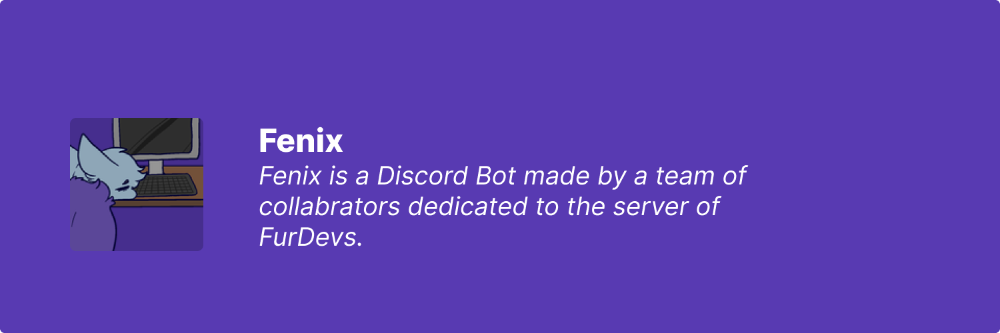

<!-- Markdown is just HTML on drugs. -->

    

## About Me:

- 🎓 High School Senior.
- 🐼 A red panda.
- 💻 Intermediate programmer.
- 💌 Easily reachable @ [hi@mozman.one](hi@mozman.one).
- ⚡ I stole your fridge and all of the contents are now gone.

## My Projects

### None...
as of now of course. I mainly work on/with organizations. As always, you can view [my public projects](https://github.com/ThatRedPandaDev?tab=projects&type=beta) as not everything will be listed here.

## My Organizations
 

<small>Wanna see the source images for this? View them on [figma.com](https://www.figma.com/file/u2PCYwtOo7MLj5pNRWxzd1/Organization-Banners?node-id=0%3A1)!</small>

<small><i>Thanks @VulpoTheDev for the README influence!</i></small> 
